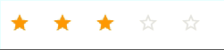

# Material Rating 
[](https://standardjs.com)
[](https://travis-ci.org/TeamWertarbyte/material-ui-rating)
[](https://greenkeeper.io/)



See this component in [action](https://mui.wertarbyte.com/#material-ui-rating)

**Stable channel**
```sh
npm install material-ui-rating
```

**Pre-release channel**
```sh
npm install material-ui-rating@next
```

Please note that `@next` will only point to pre-releases; to get the latest stable release use `@latest` instead.

## Usage
```js
import { Rating } from 'material-ui-rating'

// ...
render() {
  return(
    <div>
        <Rating
          value={3}
          max={5}
          onChange={(value) => console.log(`Rated with value ${value}`)}
        />
    </div>
  )
}
```

### Material Rating Properties

|Name            |Type        |Default     |Description
|----------------|------------|------------|--------------------------------
|disabled        | `boolean`  | `false`    | Disables the rating and gray it out if set to true.
|iconFilled      | `node`     | `<ToggleStar color={colors.orange500}/>`    | This is the icon to be used as an icon in value range.
|iconFilledRenderer           | `func`   |            | Overrides filled icon renderer.
|iconHovered     | `node`     | `<ToggleStarBorder color={colors.orange500}/>`    | This is the icon to be used as an hovered icon.
|iconHoveredRenderer           | `func`   |            | Overrides hovered icon renderer.
|itemClassName   | `string`  | | Sets classname for the item elements.
|itemIconStyle   | `object`   |            | Override the inline-icon-styles of the item elements.
|iconNormal      | `node`     | `<ToggleStarBorder color={colors.grey300}/>`    | This is the icon to be used as an normal icon.
|iconNormalRenderer           | `func`   |            | Overrides normal icon renderer.
|itemStyle       | `object`   |            | Override the inline-styles of the item elements.
|max             | `number`   | 5          | The max value of the rating bar.
|onChange       | `function` |            | Fired when a value is clicked.
|readOnly        | `boolean`  | `false`    | Don't allow input if set to true.
|style           | `object`   |            | Override the inline-styles of the root element.
|tooltip           | `node`   |            | Sets tooltip for icon in IconButton Component.
|tooltipPosition           | `string`   | `bottom-center`           | Overrides tooltip position.
|tooltipRenderer           | `func`   |            | Overrides tooltip renderer.
|tooltipStyles          | `object`   |            | Overrides tooltip styles.
|value           | `number`   | 0          | The value of the rating bar.


\* required property

## License

The files included in this repository are licensed under the MIT license.
